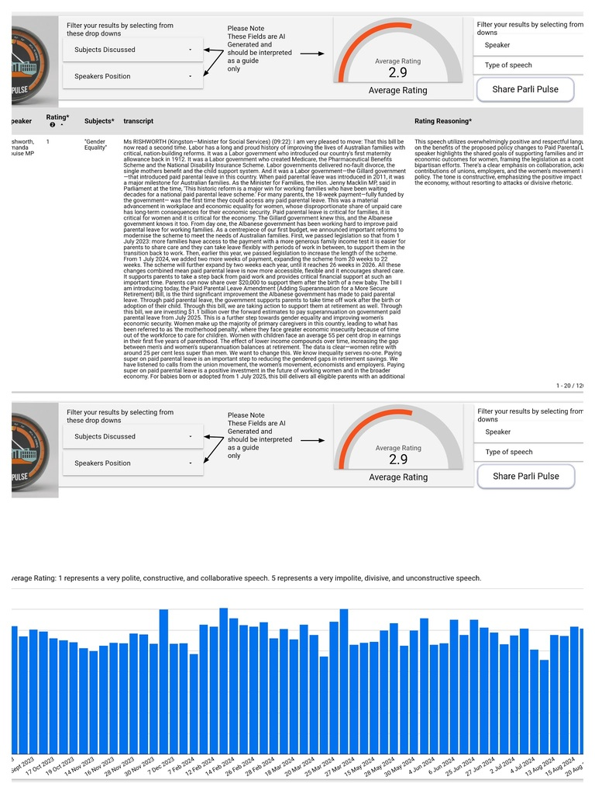

# Parli Pulse

## [GovHack 2024](https://www.govhack.org)

This GovHack project leverages Large Language Models (AI) to analyze parliamentary transcripts, 
identifying and highlighting instances of constructive (and divisive) disagreement among politicians. 

By providing this analysis, the project aims to promote healthier debate practices and ultimately 
enhance democracy by fostering a more collaborative and productive political environment.

It also aims to raise the level of public discourse around usage of AI by providing all the data and
details of how the data is used and combined with LLM prompts to produce an interesting, and hopefully
constructive result.

[Goto the interactive dashboard](https://lookerstudio.google.com/reporting/f6904783-fecd-4b04-8039-9c76e481e1b9)





## Data Sources

### [Federal Parliament - House of Reps - Official Hansard](https://www.aph.gov.au/Parliamentary_Business/Hansard)

Description: The Federal Government Hansard is the official, edited transcript of the proceedings of the Australian Parliament. It records debates, speeches, questions, and other parliamentary business

Note: I have focussed on just the House of Reps due to time constraints

Usage: I wrote a small program that [retrieves](src/psithur/govhack/get_data.clj) the House of Reps Hansards since 2012 in XML format and then [parses](src/psithur/govhack/process_xml.clj) those XML Documents into a JSON file with the following fields :-

```json
{
  "session.no": "1",
  "info-type": "PRIVILEGE",
  "date": "2018-11-29",
  "speaker-name": "Morton, Ben, MP",
  "speaker-electorate": "Tangney",
  "chamber": "House of Reps",
  "page.no": "0",
  "proof": "0",
  "parliament.no": "45",
  "speaker-party": "LP",
  "info-title": "PRIVILEGE",
  "period.no": "7",
  "text": "..."
}
```
The dataset I created for GovHack covers the following years :-

| Year | Record Count |
| --- | --- |
| 2024 | 7730 |
| 2023 | 11996 |
| 2022 | 7746 |
| 2021 | 11866 |
| 2020 | 10318 |
| 2019 | 8166 |
| 2018 | 11128 |
| 2017 | 11400 |
| 2016 | 8982 |
| 2015 | 13500 |
| 2014 | 12664 |
| 2013 | 7884 |
| 2012 | 11066 |


The types of Speech included over that timeframe :-

| info_title |	record_count	|
| --- | --- |
|	BILLS	|	50238	|
|	STATEMENTS BY MEMBERS	|	26150	|
|	MATTERS OF PUBLIC IMPORTANCE	|	12056	|
|	ADJOURNMENT	|	9752	|
|	COMMITTEES	|	7684	|
|	MOTIONS	|	5608	|
|	PRIVATE MEMBERS' BUSINESS	|	4430	|
|	BUSINESS	|	2674	|
|	CONDOLENCES	|	2206	|
|	DOCUMENTS	|	1792	|
|	DISTINGUISHED VISITORS	|	1556	|
|	STATEMENTS ON INDULGENCE	|	1392	|
|	MINISTERIAL STATEMENTS	|	1018	|
|	PERSONAL EXPLANATIONS	|	870	|
|	PETITIONS	|	838	|
|	GOVERNOR-GENERAL'S SPEECH	|	820	|
|	AUDITOR-GENERAL'S REPORTS	|	560	|
|	STATEMENTS	|	550	|
|	STATEMENT BY THE SPEAKER	|	546	|
|	PARLIAMENTARY REPRESENTATION	|	448	|
|	MINISTERIAL ARRANGEMENTS	|	438	|
|	PARLIAMENTARY OFFICE HOLDERS	|	402	|
|	RESOLUTIONS OF THE SENATE	|	324	|
|	QUESTIONS WITHOUT NOTICE	|	296	|
|	QUESTIONS WITHOUT NOTICE: ADDITIONAL ANSWERS	|	272	|
|	DELEGATION REPORTS	|	270	|
|	DEATH OF HER MAJESTY QUEEN ELIZABETH II AND ACCESSION OF HIS MAJESTY KING CHARLES III	|	226	|
|	PRIVILEGE	|	146	|
|	STATEMENTS ON SIGNIFICANT MATTERS	|	138	|
|	REGULATIONS AND DETERMINATIONS	|	134	|
|	MINISTRY	|	132	|
|	QUESTIONS TO THE SPEAKER	|	120	|
|	REGISTER OF MEMBERS' INTERESTS	|	52	|
|	TARIFF PROPOSALS	|	50	|
|	PARTY OFFICE HOLDERS	|	46	|
|	SHADOW MINISTERIAL ARRANGEMENTS	|	42	|
|	NOTICES	|	38	|
|	PARLIAMENTARY ZONE	|	32	|
|	BUDGET	|	22	|
|	SHADOW MINISTRY	|	10	|
|	ADDRESS BY THE PRIME MINISTER OF THE UNITED KINGDOM	|	8	|
|	ADDRESS BY THE PRESIDENT OF THE PEOPLE'S REPUBLIC OF CHINA	|	8	|
|	ADDRESS BY THE PRIME MINISTER OF THE REPUBLIC OF INDIA	|	8	|
|	PRIME MINISTER OF PAPUA NEW GUINEA	|	6	|
|	PRESIDENT OF THE REPUBLIC OF THE PHILIPPINES	|	6	|
|	ADDRESS BY THE PRESIDENT OF THE REPUBLIC OF INDONESIA	|	6	|
|	ADDRESS BY THE PRIME MINISTER OF JAPAN	|	6	|
|	PRESIDENT OF UKRAINE	|	6	|
|	PARLIAMENTARY RETIRING ALLOWANCES TRUST	|	6	|
|	ADDRESS BY THE PRIME MINISTER OF SINGAPORE	|	6	|
|	STATEMENTS BY THE SPEAKER	|	2	|


A big motivation for me in participating in GovHack is to make public datasets more accessable, so as part of this 
challenge I am providing a full copy of the JSON version of the Hansard dataset for over 10 years.

This means everyone has a dataset that is **far** more usable than PDF or XML of individual sittings for several reasons:

1. Ease of Analysis and Processing:

* Structured Data: JSON is a structured data format, making it easy to parse and analyze with programming languages and data analysis tools. This allows for efficient searching, filtering, and extraction of specific information. PDFs and XML, while structured in their own ways, require more complex parsing and extraction techniques.
* Machine Readability: JSON is inherently machine-readable, allowing for automated analysis and integration with other datasets or applications. This enables researchers, journalists, and developers to extract insights and patterns from the Hansard data without manual intervention. PDFs and XML, while machine-readable to some extent, require more complex processing for machine understanding.

2. Data Integration and Interoperability:

* Standard Format: JSON is a widely adopted standard for data exchange, making it easily compatible with various systems and applications. This allows for seamless integration of the Hansard data with other datasets or tools for comprehensive analysis and research. PDFs and XML, while standard formats, require more complex transformations for integration with other datasets or tools.
* API Friendliness: JSON is commonly used in APIs, making it easy to access and interact with the Hansard data programmatically. This enables developers to build applications and services that leverage the Hansard data for various purposes. PDFs and XML, while accessible through APIs, require more complex handling for programmatic interaction.
3. Efficiency and Scalability:

* Compact Size: JSON is a relatively compact data format, making it efficient to store and transmit large volumes of data. This is crucial for a dataset spanning over 10 years of Hansard transcripts, which would be significantly larger in PDF or XML format.
Database Compatibility: JSON is natively supported by many modern databases, making it easy to store and manage the Hansard data for efficient querying and retrieval. PDFs and XML, while storable in databases, require more complex handling and indexing for efficient querying.

4. Accessibility and Openness:

* Text-Based: JSON is a text-based format, making it accessible to a wide range of users and tools. This promotes openness and transparency, enabling more people to access and analyze the Hansard data for various purposes. PDFs and XML, while accessible, require specific software or tools for viewing and analysis.

In summary: A JSON version of the Hansard dataset for over 10 years offers significant advantages in terms of ease of analysis, data integration, efficiency, and accessibility. It enables researchers, journalists, developers, and the public to leverage the vast amount of parliamentary information for various purposes, promoting transparency, accountability, and informed decision-making.

You can download the processed Hansard dataset [here](https://storage.googleapis.com/parlipulse-hansards/hansard_bq.ndjson.gz)

You can also access the individual XML files [here](https://console.cloud.google.com/storage/browser/parlipulse-hansards)


## Using AI to enrich the dataset

After getting the data into a format that was more usable for reuse and "Hacking", my next step was to figure out how
to use a Large Language Model to enrich the unstructured dataset - politicians speeches in parliament.

I decided to use Google's platform and the Gemini Pro 1.5 model and given the time constraints, I needed to analyse
thousands of free text speeches as quickly as possible.

I started by [uploading my dataset into BigQuery](https://cloud.google.com/bigquery/docs/loading-data-cloud-storage-json#loading_json_data_into_a_new_table), 
and then following [the instructions](https://cloud.google.com/bigquery/docs/generate-text) to connect BigQuery
with [Gemini Pro 1.5](https://cloud.google.com/bigquery/docs/reference/standard-sql/bigqueryml-syntax-create-remote-model#endpoint)

If I had more time, I would have explored other available models to ascertain whether a smaller (cheaper) model
would provide comparable results.

Once I had BigQuery and Gemini talking, the next step was to iterate through a series of LLM Prompts to find
the right instructions for the model to classify the data.

As I was working in the GovHack Hackerspace in Canberra while working on this element of my entry, I was able to 
crowd source improvements to the prompt over an hour or two. Thanks to those mentors who helped!

Here's an example of testing a prompt on 10 random speeches.

```sql
CREATE TABLE `govhack-24-parlipulse.federal_hansard.first_output` as
SELECT *
FROM ML.GENERATE_TEXT(
  MODEL `govhack-24-parlipulse.federal_hansard.g15pro`,
      (
      SELECT CONCAT(
        """You are a analyst at a think tank that studies deliberative Democracy and strengthening global governance. 
        Analyze the following transcript of a political speech in parliament and classify its overall tone and content on a scale of 1 to 5 (RATING) where:

* **1** represents a **very polite, constructive, and collaborative** speech.
* **5** represents a **very impolite, divisive, and unconstructive** speech.

Consider the following factors in your analysis:

* **Language and Tone:** Assess the use of respectful language, the presence of personal attacks or inflammatory rhetoric, and the overall tone of the speech (e.g., conciliatory vs. antagonistic).
* **Focus on Issues:** Evaluate whether the speech primarily focuses on addressing policy issues and presenting solutions or if it's centered on criticizing opponents and creating division.
* **Collaboration and Compromise:** Determine if the speech demonstrates a willingness to collaborate with others, find common ground, and seek compromise, or if it adopts a rigid and uncompromising stance.
* **Respect for Others:** Consider whether the speech shows respect for differing viewpoints and acknowledges the contributions of others, or if it dismisses opposing perspectives and seeks to undermine them.

Provide specific examples from the transcript to support your classification in the REASONING field. 
Summarize the key subjects or issues being discussed, in the SUBJECTS field 
Identify the speakers primary position on the key subjects, whether they Supports or Opposes in the POSITION field.

Your response should be a JSON object without backticks or anything else, in the following form

{
 "RATING":YOUR_RATING, #Number between 1 and 5
 "SUBJECTS":SUBJECTS_DISCUSSED, #Top 3, each in no more than one to two words, prioritising specific policy proposals if relevant (e.g. Climate; Taxation; Migration)
 "POSITION":SPEAKERS_POSITION_ON_SUBJECT, #One of the following, with no other content: "Supports; Opposes; Other"
 "REASONING":REASONING #Free text, no more than 200 words
 }

Input transcript:
"""
      , text) AS prompt, speaker_party, speaker_electorate, info_title, date, speaker_name,
 CHAR_LENGTH(text) AS character_count

      FROM federal_hansard.import
      WHERE date >= DATE_SUB(CURRENT_DATE(), INTERVAL 12 MONTH)
and info_title IN ('BILLS', 'STATEMENTS BY MEMBERS', 'MATTERS OF PUBLIC IMPORTANCE', 'MOTIONS', "PRIVATE MEMBERS' BUSINESS", "QUESTIONS WITHOUT NOTICE: ADDITIONAL ANSWERS")

    ),
  
  STRUCT(4096 AS max_output_tokens, 0 AS temperature,
  0.95 AS top_p, true AS flatten_json_output,
  false AS ground_with_google_search)
);
```

The prompt above is the last prompt - the one that I used to produce the output dataset below 
and that drives the interactive dashboard. 

My initial attempt to run this prompt over all the data timed out after 6 hours..., so instead I decided to run
it over the last 12 months (to 7 Sept 2024) resulting in over 4,000 enriched records.

This took almost 4 hours to run (I did not have any time to look at optimising this part of my analysis unfortunately).

You can download this dataset [here](https://storage.googleapis.com/parlipulse-hansards/ai_enriched_hansard_12_months_to_sept24.ndjson.gz) 
or explore the data using an interactive dashboard [here](https://lookerstudio.google.com/reporting/f6904783-fecd-4b04-8039-9c76e481e1b9)

I would love to extend this analysis further in the future.

### Iterating through prompts

#### Prompt 1

Prompt: Summarize this text

Result :

```

"This is a transcript of a speech by Australian politician Mr. McCormack criticizing a proposed Banking Amendment Bill. He argues that the bill, which allows the government to claim money from inactive bank accounts after three years, is tantamount to theft. 

McCormack likens the government to infamous Australian bushrangers, accusing them of stealing from hardworking Australians, including pensioners, farmers, and even children with Dollarmite accounts, to compensate for their own financial mismanagement and inability to deliver on promised budget surpluses. 

He cites examples like the case of a 95-year-old pensioner who lost $50,000"	
```


Speech: 

```
McCORMACK (Riverina) (20:08): Jack Donahue, Frank Gardiner, Johnny Gilbert, Ben Hall, Ned Kelly, Dan Morgan, Andrew George Scott—alias Captain Moonlite—and Frederick Ward—alias Captain Thunderbolt—all names from the 19th century and all bushrangers. They stole from other colonial Australians to feather their own nests. And we thought that they belonged back in the 1800s but, alas, the bushrangers ride again. They are on that side of the House, and now they are coming to a bank account near you. This Banking Amendment (Unclaimed Money) Bill 2013 is seeing yet another raft of bushrangers coming to a bank account near you. It could be anyone's bank account. If it has not been active in the last three years then look out! Certainly, there has been a chorus of complaint right across this wide brown land about the 21st century bushrangers who are just waiting to take unclaimed money. This is, after all, theft by any other name. I am going to quote from the Hervey Bay Independent— Mr Neumann interjecting— Mr McCORMACK: Pardon? I am sorry: the parliamentary secretary at the table is saying something I cannot hear, but I will allow his interjection. What was that? Mr Neumann interjecting— Mr McCORMACK: No, it is theft, and you know it is theft! The member at the table knows that it is theft. The member for Blair probably has examples in his own electorate: people who have had their bank accounts raided by this Labor government. He has some explaining to do when they ring his office and say: 'Mr Neumann, why are my bank accounts being taken by your government in the dead of night? It's not fair.' He knows it is not fair, his colleagues know it is not fair and we on this side certainly know it is unfair. I was going to quote from the Hervey Bay Independent of 31 May: The family of a 95-year-old Hervey Bay pensioner who had $50,000 forfeited from a bank account because it hadn't been used for seven years is warning others to be aware of the laws. Craignish resident Jan Powell said she was shocked last week when she went to check on the status of an account her mother opened in 2002, established to pay— wait for it— her own funeral costs, and found the balance had gone from $49,000— to what? What do you think it was? Mr Van Manen: Zero! Mr McCORMACK: Absolutely zero! You are right—you are so correct, member for Forde. It was absolutely zero. Mrs Powell said: I contacted the bank and after being shuffled around I was told that it was Federal Government law that if an account had been inactive for seven years the money was forfeited to the government … I can just imagine what people are feeling now these bank accounts have been reduced to a three-year period. I continue to quote Mrs Powell: I was furious and asked why my mother wasn't contacted and told it would be taken. She has another account with the ANZ Bank that she has her pension put into—so it couldn't have been too hard to track her down. This account was opened in 2002 after her husband died and she saw the strain the funeral costs put on the family so she wanted to save for her own funeral so this wouldn't happen again. Under Australia law cheque or savings accounts that have been inactive for more than seven years are forfeited to the crown. We have known that, but now it is down to three years. Banks must, by March 31 each year— A government member interjecting— Mr McCORMACK: Stop interjecting and listen; you might learn something: … deliver to the Treasurer a register of all unclaimed accounts worth $500 or more, which is then published in the Government Gazette. The Australian Securities and Investments Commission reports Queenslanders' pool of unclaimed money from dormant accounts is now more than $71 million. This actual bill is going to mean that there could be a boost to the budget bottom line of almost $900 million—that is nearly $1 billion under a plan to transfer millions in unclaimed money to the taxman and the corporate regulator. And who is putting this in place? Is it Ned Kelly? Is it Johnny Gilbert? Is it Ben Hall? No—it is the Treasurer! It is the Prime Minister! It is this government, who are 21st century bushrangers coming to a bank account near you—probably your bank account. The government is going to collect an extra $675 million—and I am quoting from the National Times of 22 October 2012: In a measure announced today, the government will collect an extra $675 million by lowering the threshold at which lost superannuation accounts are automatically moved to the Australian Tax Office. But why is this necessary? We all know it is necessary—well, not really 'necessary'; that is probably not quite the correct word to use—that it is happening because this government cannot manage its own finances. It will do anything and it will stop at nothing to balance its books, even if that means taking money out of people's bank accounts where they have saved for their own funerals. Even if it means taking some of those children's Dollarmite accounts that have been inactive for three years and even if it means—as in some examples from near my electorate down in the Riverina—taking the money from people's farm management accounts. Those people have put their money in and they expect it to be there. They have had a hard enough time in recent years with drought, with floods, with fires, with poor water policy from the government. Now they have the 21st century Ned Kellys coming along and taking their hard-earned money. It is outrageous. It is simply unbelievable. But this is the Labor government of 2013. Ben Hall rides again! Never mind the Eugowra Rocks gold robbery, the stagecoach hold-up; this is classic bushranging in the 21st century. People are having their hard-earned money taken from them just to help balance the Treasurer's books. It is just incredible. I refer to a website, Simplifying Your Life Choices, and a comment piece by Rachel Tyler Jones. On 27 February this year in an opinion piece called 'The dummies guide to losing an election', she wrote: I'm no politician, but even I know that taking people's money is a stupid way to win an election. The Government did not consult the Australian Bankers Association … about the new three-year time limit—the figure appears to be an arbitrary one. Even as a Labor supporter— Her words, not mine. I am certainly no Labor supporter. Rachel Tyler Jones further wrote: Even as a Labor supporter, I am struggling to see this as anything but a desperate grab for money by a government that can't live up to its (retracted) budget surplus promises. We have just heard the member for Bradfield describing this as ill-judged, chaotic, desperate, unseemly and an ethically questionable grab for cash. He talked about the extraordinary provisions that this government has gone to to raid what in some cases are people's life savings, to raid what some people have put away to pay for their own funerals, to raid farm bank accounts and to raid kids' Dollarmite savings accounts. It is truly extraordinary. On the website freedomwatch.IPA.org.au of the Institute of Public Affairs, Simon Breheny writes: The Gillard government's plan to take money from dormant bank accounts is a shameful grab for cash and a significant attack on property rights. He is the Director of the Legal Rights Project at the Institute of Public Affairs, a free-market think tank. What he has said here is what people right across Australia are saying, right at this very minute. They are not just coalition supporters, they are Labor supporters—they are once rusted on ALP voters, unionists who have also had their bank accounts raided by these modern-day Captain Moonlites and Captain Thunderbolts. They are not riding in on their horse or holding up a stagecoach or jumping through your window in the dead of night; they are coming through by stealth—coming to a bank account near you. I urge anybody listening to consider this if they have a dormant bank account that they have their funeral payment savings tucked away in, or if they have a farm deposit management account. Any kids who are still up, at 20 past eight this evening, and are perhaps watching this because the cartoons are not on any more, I would urge them to ask mum and dad to make sure they check their bank accounts, because the Labor government might be coming to take them. That is a dreadful thing to say to the children, and I certainly do not want to scare them, but it is the truth. It is the reality of the 21st century Ned Kellys we have got all the other side of the House. Mr Breheny said: People should be able to leave money in bank accounts for as long as they wish without the fear that the government might come along and steal it from them. To do so is an arbitrary acquisition of property by the government. The seven-year clause has been in place for some time, but we have reached a new low now that this government has reduced that to three years. Why has it been reduced to three years? Simply to pay for the Treasurer's inefficiency. He has had six goes at getting the budget right. How many times do you think he has produced a budget deficit? Any guesses? He has not produced one single surplus. He has produced six out of six budget deficits. When the election is held on 14 September, if we on this side of the House are fortunate enough to get the faith of the people of Australia and they vote for our side of politics to once again restore dignity to the parliament and to govern Australia for the 44th parliamentary term, it is going to take 20 consecutive years at over and above any surplus that the Howard government ever produced to make sure that the debt that this government has racked up is paid off. I repeat: it is going to take 20 consecutive years at above the highest surplus that the Howard government ever produced to pay for the debt that this mob has racked up. That is shameful. This raid on people's bank accounts is also shameful. To think that we in Australia, in this great country of ours, have to have kids' and pensioners' and hard-working Australians' bank accounts pinched, robbed, raided, taken, stolen—call it what you like—by people from the Labor side is just truly remarkable. It is a disgrace. We thought that the bushrangers belonged in the Edgar Penzig books. We thought that they belonged in Robbery Under Arms and those other great books and movies about 19th-century colonial Australia. But, no, they belong here again—they are running the Treasury on the Labor side of politics. It is truly a disgrace. We have got poor Jan Powell concerned about the missing $50,000 her mum had tucked away to help pay for her own funeral. We have got farm management deposits scheme raided, when the poor farmers are under enough pressure as it is to try to make ends meet because there has never been good public policy in the last five years from this Rudd-Gillard, possibly Rudd again, government. We have now possibly got the kids' school bank accounts under threat because they have not had any activity in three years. All this is because the Treasurer simply cannot add up. The Treasurer simply comes out and says that he is going to produce a budget surplus, and we have got the Prime Minister backing him up and saying, 'Yes, we are going to produce a surplus,' over and over and over again. Hundreds of times the Prime Minister and her loyal deputy are on the record saying, 'We are going to produce a budget surplus,' and what did we get in the last budget—another deficit and more debt. And on top of all that, we are now getting the kids and pensioners and the hardworking businesspeople and families of Australia having their bank accounts pinched, robbed and taken by this government. It is simply a disgrace. People will not stand for this and nor should they. They should not have to put up with this. This place should be the epitome of democracy. This government should be ruling for all Australians and showing that they care about hardworking people's bank accounts, about the Dollarmite savings accounts and about funeral nest eggs for people, but they do not. They are just pinching it to make up for their Treasurer's absolute ignorance as to how he could possibly ever produce a budget surplus. (Time expired)
```
